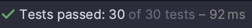

# 2일 차 회고

---

# 프리코스 2일 차 10/20

## 숫자 야구 게임 리팩토링

### 랜덤 넘버 생성 문제
숫자 야구 게임을 실행하면서 기능 구현을 확인하고 있었는데 생성된 컴퓨터의 숫자가 오름차순으로 정렬된 것 같았다.

실제로 그런지 확인하기 위해 간단한 테스트 코드를 작성했다.
```java
@RepeatedTest(30)
void isSortAscending() {
    int startInclusive = 1;
    int endInclusive = 3;
    int digit = 3;

    List<Integer> generatedNumbers = NumberGenerator.generateUniqueNumbers(startInclusive, endInclusive, digit);
    Integer first = generatedNumbers.get(0);
    Integer second = generatedNumbers.get(1);
    Integer third = generatedNumbers.get(2);

    assertThat(first < second).isEqualTo( true);
    assertThat(second < third).isEqualTo( true);
    assertThat(first < third).isEqualTo( true);
}
```
:::tip
`@RepeatedTest`를 사용하면 테스트를 반복해서 진행할 수 있다.
:::

테스트를 실행한 결과는 내 예상대로 항상 오름차순으로 정렬되어 있었다.



문제가 되는 `generateUniqueNumbers()`메서드를 살펴봤다.
```java
public static List<Integer> generateUniqueNumbers(int startInclusive, int endInclusive, int digit) {
    validate(startInclusive, endInclusive, digit);
    Set<Integer> numbers = new HashSet<>(); // [!code hl]
    while (numbers.size() < digit) {
        int generatedRandomNumber = generateRandomNumber(startInclusive, endInclusive);
        numbers.add(generatedRandomNumber);
    }
    return List.copyOf(numbers);
}
```
내가 작성한 메서드는 자릿수가 채워질 때까지 while문을 반복하면서 랜덤한 숫자를 `Set`에 넣어준다. 

중복을 제거하기 위해 `Set`을 사용했는데, 문제가 발생한 이유는 잘못된 구현체를 사용했기 때문이다. `HashSet`은 원소의 순서를 보장하지 않는다. Hashcode 값을 가지고 인덱싱을 해서 오름차순으로 정렬된 것처럼 보였던 것이다.

이를 해결하기 위해 `LinkedHashSet`을 사용하게 변경했다. `LinkedHashSet`은 입력된 원소의 순서를 보장하기 때문에 내가 필요로 하는 특성과 딱 맞았다.

겉으로 드러나지 않는 버그라 자칫하면 놓칠 수도 있었는데 찾아서 참 다행이다. 각 자료구조의 특성을 잘 파악하고 올바른 자료구조를 사용하는 게 중요하다는 걸 다시금 느꼈다.

### 분리된 책임 개선하기

프로그램 흐름을 제어하기 위해 2개의 Enum Class를 만들었었다. 하나는 재시작/종료를 저장하는 클래스고 다른 하나는 게임 결과(PLAY, END)를 저장하는 클래스다.

컨트롤러는 두 개의 Enum 상수 값에 따라서 프로그램 흐름을 제어했다.

어제 작성한 코드를 보고 프로그램 흐름을 제어하는 책임을 두 클래스가 나눠서 한다고 생각이 들었다. 만약 제어 로직을 변경해야 한다면, 두 클래스를 확인하면서 수정해야 하는 문제가 발생한다.

이를 개선하기 위해 게임 상태 값을 가지는 `GameStatus` 클래스를 생성하고 컨트롤러 코드를 수정했다. 
```java
class BaseballGameController {
    ...
    public void run() {
        GameStatus gameStatus = GameStatus.RUN;
        outputView.printGameStart();

        while (gameStatus.isNotEnd()) { // [!code hl]
            Balls computer = createComputer();

            while (gameStatus.isNotClear()) { // [!code hl]
                gameStatus = play(computer);
            }

            outputView.printGameEnd();
            GameCommand gameCommand = getGameCommand();
            gameStatus = GameStatus.from(gameCommand);
        }
    }
    ...
}
```
컨트롤러는 `GameStatus`에게 종료 및 클리어 여부를 묻는 메세지를 보내고 그 결과에 따라 프로그램을 실행한다.

프로그램 상태를 관리하는 책임을 하나의 클래스가 하게되어 관리가 용이한 구조가 되었다.

## 더 나아가기

### InputView 의 책임과 역할

토론하기에 `InputView`의 책임과 역할에 대해 묻는 글이 올라왔다. 여기에 대한 내생각은 다음과 같다.

`InputView`는 입력을 받는 책임을 가지고, 입력을 받고 간단한 검증을 하는 역할을 해야한다고 생각한다.

이번 미션의 플레이어 숫자를 입력받는 기능을 예로 들면
```java
class InputView() {
    public int readPlayerNumber() {
        print("플레이어 수를 입력해주세요");
        String input = readLine();
        return parseInt(input);
    }
}
```
입력 받은 플레이어 숫자를 간단한 검증(숫자인지?)을 하고 변환해서 컨트롤러에 넘겨준다.

그런데 `InputView`가 숫자 야구 게임이 아닌 다른 게임에서도 사용이 가능해야 한다는 의견도 있었다. 재사용성을 높여서 어느 곳에서도 사용할 수 있어야 한다고 말씀하셨는데, 공감되는 의견이어서 재사용이 가능하게 리팩토링해 볼 예정이다.

## 마치며

Balls 테스트 코드를 MethodSource를 사용하는 걸로 변경했는데 중복되는 코드가 너무 많아져서 개선할 방법을 찾아야겠다.

오브젝트라는 책을 추천받아서 구매를 했는데 객체지향에 대한 내용을 구현 코드로 설명해줘서 이해가 잘 된다. 빨리 읽고 프리코스 미션에 적용하고 싶다.