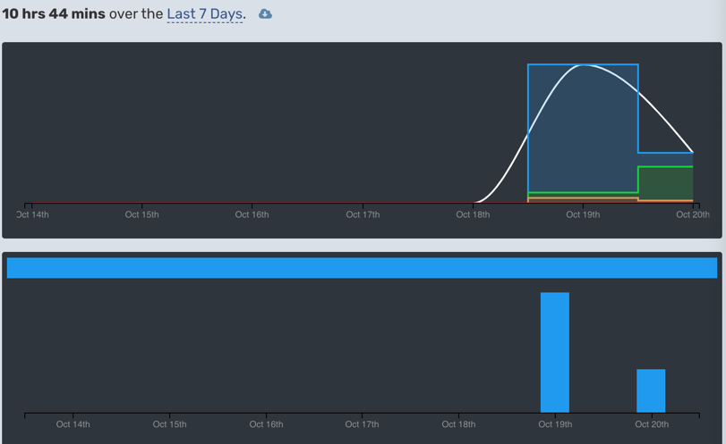
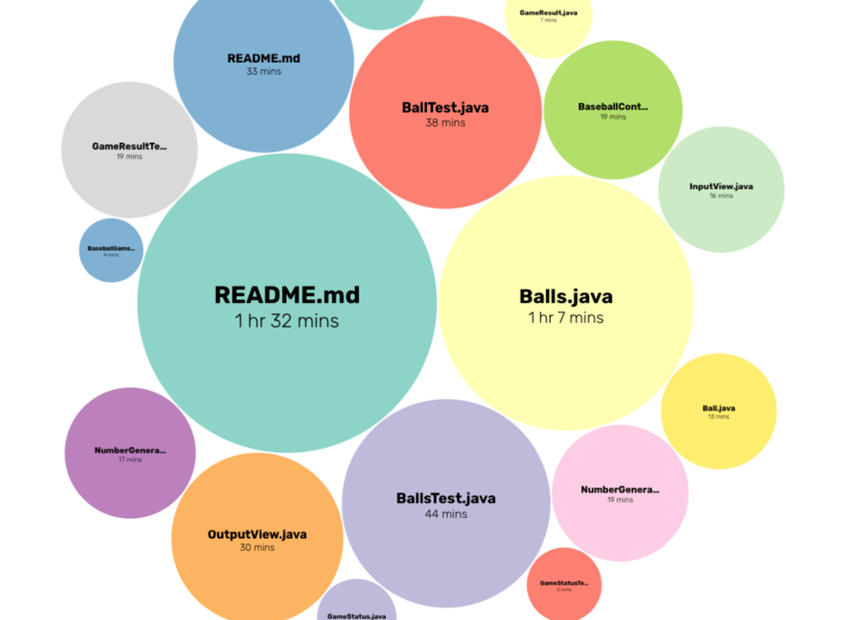
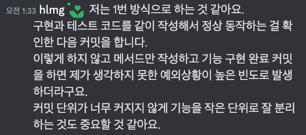

# 1일 차 회고

---

# 프리코스 시작 10/19

오늘 드디어 프리코스가 시작됐다. 어제만 해도 조용했던 디스코드 채널이 유튜브 라이브와 동시에 많은 글이 올라왔다. 이번 6기 지원자 수가 4555명 이라고 하는데 정말 인기가 많은 프로그램이라는 걸 느낄 수
있었다.

3시에 도착한 미션 메일을 받고나니 이제 진짜 시작이구나 하는 생각에 설레이는 마음을 내려놓고 메일 내용을 꼼꼼히 읽어나갔다.

메일에 몇 가지 주의사항이 있었는데 주의사항을 안 지켜서 떨어지는 일이 없도록 아래처럼 작성해놨다.

:::danger ‼️주의사항
미션은 `제출 가능 시간에 제출`해야 한다. 정해진 시간을 지키지 않은 경우, `미션을 제출하지 않은 것`으로 한다.

우리 모두의 `스스로 할 기회`를 위해 아직 마감되지 않은 `미션에 관련된 질문과 답변`은 `마감 이후`로 미뤄 주세요.
:::

주의사항을 모두 숙지했으니 미션을 진행했다.

## 숫자 야구 게임

숫자 야구 게임 미션의 요구사항을 읽고 해야 할 일을 정리했다.

- Java 코드 컨벤션 읽기
- JDK 17버전으로 변경하기
- docs/README.md에 구현할 기능 목록 작성하기

### Java 코드 컨벤션

우테코는 Google Java Style Guide를 기준으로 하는데 몇 가지 다른 부분이 있었다. 문서를 읽고 익숙하지 않은 내용을 목록으로 정리했다.

:::info Java Style Guide
[3.4.2.1 Overloads: never split](https://google.github.io/styleguide/javaguide.html#s4.1.1-braces-always-used)

메서드 오버로드를 하면 그 사이에 다른 멤버가 있으면 안된다.

---

[4.1.1 Use of optional braces](https://google.github.io/styleguide/javaguide.html#s4.1.1-braces-always-used)

중괄호는 생략할 수 있는 경우에도 작성해야 한다.

---

줄 바꿈

비 할당 연산자의 앞에서 한다.

- `.`, `::`, ampersand(<T extends Foo `&` Bar>), pipe(catch (FooException `|` BarException e)))

할당 연산자의 뒤에서 한다.(앞에서 해도 됨)

---

접근 제한자 순서

`public protected private abstract default static final transient volatile synchronized native strictfp`
:::

추가로 커뮤니티에서 IDE에 코드 매터를 등록하면 편하다는 정보를
얻고 [intellij-java-wooteco-style.xml](https://github.com/woowacourse/woowacourse-docs/blob/main/styleguide/java/intellij-java-wooteco-style.xml)
을 적용해서 코드 포맷팅을 자동으로 할 수 있게 설정했다.

### JDK 17 버전으로 변경하기

프로그래밍 요구 사항에 JDK 17 버전에서 실행해야 한다고 적혀있었다. 내 터미널 자바 버전과 달라서 변경이 필요했다.

나는 zsh을 사용중이라 `.zshrc`를 편집해주고 `source` 명령어로 편집 내용을 적용했다.

커뮤니티에서 `asdf` 라는 프로그래밍 언어 버전 관리 도구를 소개받아서 다음엔 이걸 적용할 예정이다.

### docs/README.md에 구현할 기능 목록 작성하기

구현할 기능 목록을 작성해야 하는데 기존에 내가 작성하던 방식은 아래와 같았다.

- 컴퓨터 숫자 생성 기능
- 플레이어 숫자 입력받는 기능
- ...
  이렇게 목록으로 쭉 나열을 했었는데 게임 흐름에 따라 기능을 쭉 나열한 것 같아서 마음에 들지 않았다.

그러다 문득 "객체의 관점에서 기능을 작성하면 어떨까?"라는 생각이 들었고 필요한 객체를 먼저 적고 각 객체에 필요한 기능을 작성했다.

:::details 기능 목록

```md
Domain

- Ball
    - `Ball` 생성 기능
        - 숫자를 입력받아 `Ball`을 생성한다.
        - 숫자는 1이상 9이하여야 한다.
- Balls
    - `Balls` 생성 기능
        - 세 자리 숫자를 입력받아 `Balls`를 생성한다.
    - 볼 개수를 판단하는 기능
        - `Balls` 를 입력받아 볼 개수를 반환한다.
    - 스트라이크 개수를 판단하는 기능
        - `Balls` 를 입력받아 스트라이크 개수를 반환한다.
- GameResult
    - 게임 결과를 반환하는 기능
        - 볼, 스트라이크 개수를 입력받아 `GameResult`를 반환한다.
- GameStatus
    - 재시작/종료를 반환하는 기능
        - 숫자를 입력받아 `GameStatus`를 반환한다.

Input

- 플레이어 숫자를 입력받는 기능
- 재시작/종료를 입력받는 기능

Output

- 볼, 스트라이크 개수를 출력하는 기능
- 게임 시작 메세지 출력 기능
- 게임 종료 메세지 출력 기능

Utils

- NumberGenerator
    - 중복되지 않는 랜덤한 숫자를 생성하는 기능
        - 숫자의 범위와 자릿수를 입력받아 랜덤한 숫자를 반환한다.
```

:::

이렇게 작성하니 생각할 게 많아져서 목록을 작성하는 데 시간이 오래 걸렸다. 하지만 각 객체가 하는 역할을 한 눈에 볼 수 있고 도메인을 자세하게 구분해놔서 구현 시간이 단축되는 효과가 있었다. 다른 분들은 어떻게
작성하는 지 궁금해서 이번 주 차 미션이 끝나면 코드 리뷰를 하면서 자세히 살펴 볼 예정이다.

## 더 나아가기

### 테스트 코드 메서드 이름

기능을 구현하면서 테스트 코드 메서드명을 어떻게 지어야할까? 고민을 많이 했다. 검색했을 때 많은 포스팅을 찾을 수 있었고 나는
이 [블로그](https://velog.io/@no1msh1217/%ED%85%8C%EC%8A%A4%ED%8A%B8-%EC%BD%94%EB%93%9C-%EB%A9%94%EC%84%9C%EB%93%9C-%EC%9D%B4%EB%A6%84%EC%97%90-%EA%B4%80%ED%95%98%EC%97%AC)
를 참고해서 메서드명을 지었다.

이후에 커뮤니티에 메서드명에 대한 토론이 올라왔다. 댓글을 보면서 다른 분들은 어떻게 테스트 코드 이름을 짓는지 알 수 있었는데 한글로 테스트 코드 메서드명을 짓는 분도 계셨다.

영어로 메서드 이름을 작성해도 DisplayName에 한글로 설명을 한번 더 적게 되는데 한글로 이름을 지으면 DisplayName을 따로 적지 않아도 돼서 좋은 방법이라고 생각됐다.

### Wakatime plugin 적용

함께 나누기에 몰입 관련한 서비스를 추천해 주셨다. `Wakatime`이란 서비스인데 자동으로 programming metrics을 수집하고 Dashboard에 보여준다.



다음처럼 파일별로 소요한 시간을 볼 수도 있다.



오늘 기능구현목록을 작성하는 데 고민을 많이해서 README.md 시간이 가장 많은걸로 표시됐다. 학습 기록용도로 아주 좋은 것 같아서 앞으로도 계속 사용할 예정이다.

### Git 커밋 주기

Git 커밋 주기 관련해서 토론이 올라왔다. 핵심 기능의 복잡한 로직을 작성할 때 다음 중 어떤 방식으로 커밋을 하는지 의견을 물어보셨다.

- 여러 부속 메소드들을 포함한 전체 기능이 잘 동작하는지 확인해보고 커밋
- 비록 정상적으로 동작하지 않을 수도 있지만, 개별 메소드를 완성한 그 즉시 커밋

나는 정상 동작은 확인해야 한다고 생각해서 이렇게 의견을 남겼다.



다른 분들은 2번의 커밋 방식을 많이 사용하셨는데 세세하게 커밋해서 문제가 생기면 롤백할 시점을 파악하기 쉽다는 게 그 이유였다. 나도 어느정도 공감되는 부분이었고 기능을 세부적으로 잘 나눠야겠다고 생각했다.

## 마치며

집중해서 공부하다보니 어느덧 1시가 넘었는데 아직 공부하는 분들이 많이 계셨다. 항상 혼자 공부하다가 다른 사람들이랑 같이 공부하는 게 오랜만인데 진짜 너무 재밌다 :)

오늘 커뮤니티에서 여러 의견도 남기고 소소한 잡담도 하면서 얻어간 게 정말 많았다. 토론을 하면서 다양한 생각을 들어볼 수 있는 점도 좋았다. 우테코 신청하길 정말 잘한것 같고, 커뮤니티 활동도 종종 해야겠다.
