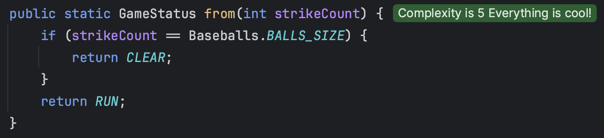
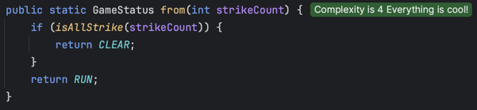
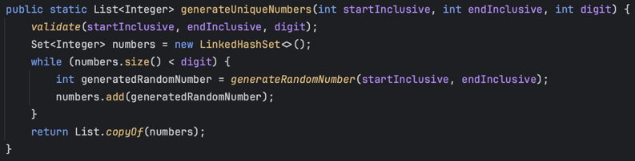
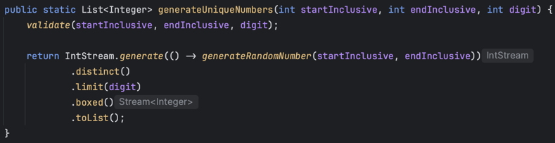

# 3일 차 회고

---

# 프리코스 3일 차 10/21

## 코드 복잡도

어제부터 계속 리팩토링을 하고 있는데 어떤 기준으로 진행해야 할 지 감이 잡히질 않았다. 그러다 문득 커뮤니티에서 봤던 `CodeMetrics`가 생각났다.

`CodeMetrics`는 인텔리제이 마켓플레이스에서 쉽게 받을 수 있고 적용하면 아래 사진처럼 클래스나 메서드의 복잡도를 보여준다.

코드 복잡도에 대해서 더 알아보니, 복잡도가 낮을수록 유지보수, 디버깅이 수월하고 오류 발생 가능성이 적고, 읽는 시간이 줄어들어 생산성이 향상된다고 한다.

[Microsoft의 순환 복잡성 문서](https://learn.microsoft.com/ko-kr/visualstudio/code-quality/code-metrics-cyclomatic-complexity?view=vs-2022)에 따르면 코드 복잡도의 제한은 10이하가 좋고 15까지도 괜찮다고 한다. 코드 복잡도와 버그 발생률은 상관 관계가 있다고 하니 가독성을 해치지 않는 선에서 최대한 줄이는 게 좋을 것 같았다.

그래서 오늘은 코드 복잡도를 줄이고 가독성을 높이는 방식의 리팩토링을 진행했다.

## 메서드 분리

내가 작성한 코드엔 다음처럼 if 안에서 조건을 확인하는 코드가 곳곳에 있었다. 

위 코드를 처음 보면 이렇게 읽게 된다. `스트라이크 수가 Baseball에 있는 BALLS_SIZE와 같으면 CLEAR 반환`

문장을 읽어도 쉽게 이해되지 않고, 같으면 CLEAR를 반환하나보다 하고 넘어가게 된다.

코드의 가독성에 문제가 있다고 생각되어 다음과 같이 리팩토링을 진행했다.

이 코드는 다음과 같이 읽힌다. `전부 스트라이크면 클리어` 이전 코드에 비해 읽기도 쉽고 이해도 확실하게 된다.

기존에는 메서드가 여러 기능을 하면 나누는 목적으로 메서드 분리를 진행했는데, 메서드를 분리하고 적절한 이름을 지어줘서 코드의 가독성을 높일 수도 있다는 걸 알게되었다.

## 스트림 적용

자바 8부터 도입된 스트림은 코드를 간결하게 만들어 준다. 스트림을 잘 사용하면 코드의 가독성을 높일 수 있다.

아래는 기존에 내가 작성한 중복되지 않는 숫자를 생성하는 메서드다.

첫 줄인 validate를 제외하면 이 메서드는 이렇게 읽힌다. `number를 담는 Set을 생성하고 set의 크기가 자릿수보다 작으면 반복문을 실행한다. 랜덤 넘버를 생성해서 셋에 넣는다 이후 리스트로 반환한다`

너무 길고 이해하기도 쉽지 않다. Set의 특징을 모르는 사람이라면 왜 Set을 사용했는지도 알 수 없을 것이다. 물론 조건문을 앞에 사용한 메서드 분리를 활용해서 개선할 수 있겠지만 그렇다 하더라도 읽기 힘든건 마찬가지다.

스트림을 사용하면 다음과 같이 코드를 개선할 수 있다.

이 코드는 Stream을 아는 사람이라면 이렇게 읽을 수 있다. `랜덤 넘버를 생성해서 중복 제거하고 digit 수 만큼 List에 넣어서 가져온다.`

코드의 양도 적고 흐름도 이해하기 쉽다.

이번에 스트림을 적용하면서 `generate()`를 처음 써봤다. 좀 헤매서 시간이 오래 걸렸는데, 다음에 무한 스트림이 필요하면 바로 적용해서 써야겠다.

:::warning
이펙티브 자바의 item45를 보면 스트림을 과용하면 오히려 프로그램을 읽기 어려워진다고 한다. 이 점을 주의하면서 반복문과 스트림을 적절히 조합해서 코드의 가독성을 높이자.
:::

## 마치며

오늘은 어떻게 하면 코드를 개선할 수 있을지 고민하고 자료를 찾아보는 데 시간이 오래 걸렸다. 코드 작성한 시간보다 고민한 시간이 더 길었다.

특히 OutputView의 분기문을 오랜 시간을 들여서 리팩토링 했는데, 가독성이 오히려 안 좋아져서 다시 원복하기도 했다.

제대로 하고있는 건 맞는지, 속도가 느린건 아닌지 조급한 마음이 들던 중 위로가 되는 문구를 발견했다.

오늘 어떤 분이 커뮤니티에 남겨주신 말이다.

덕분에 조급한 마음을 버리고 꾸준히 하면 좋은 결과가 있을 거라고 마음을 다잡을 수 있었다. 힘이되는 말을 해주셔서 정말 감사하다.