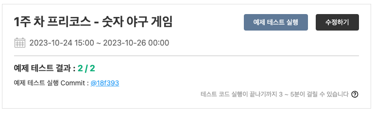

# 6일 차 회고

---

# 프리코스 6일 차 10/24

첫 주차 미션이 벌써 끝나간다. 오늘 오후 3시부터는 과제 제출이 가능하다. 과제 제출할 때 소감문을 같이 작성해야 하는데, 소감문은 마감일 전에 수정이 가능해서 제출 먼저 하기로 했다.

woowacourse 저장소로 PR을 날리고 지원 페이지에서 제출을 진행했다.

제출하면 이렇게 예제 테스트 결과가 나온다. 실제 성적과 무관하기 때문에 제출한 코드에 이상이 없는지 확인하는 용도라고 한다.

과제 제출 후 진행 소감을 작성했다.

나는 소감문에 느끼고 배운 점과 많은 시간을 투자한 부분을 적었다. 느끼고 배운 점에는 프리코스 커뮤니티 활동을 하면서 재미를 느끼고 힘이 됐던 내용 하나랑 요구사항이 좋은 코드를 유도한다는 사실을 느꼈다고 작성했다.
많은 시간을 투자한 부분에는 첫 주차인 만큼 좋은 습관을 기르려고 했는데, 관련한 내용을 작성했다.

아직 다 작성한 건 아니라 내일 마감 전에 수정해서 최종 제출할 예정이다.
