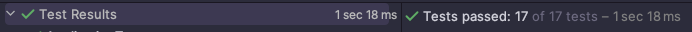

# 11일 차 회고

---

# 프리코스 11일 차 10/29

오늘은 자동차 경주 미션 구현을 완료했다.

구현 시간이 너무 오래 걸렸는데, 내가 테스트에 작성한 검증문이 기능 동작을 제대로 확인하는 방법인지 정확한 판단이 서질 않아서 테스트를 작성할 때마다 고민을 하는 게 문제인 것 같다. 그래서 어딘가에서 추천받은
인프런에 있는 "실용적인 테스트 가이드"를 구매해서 봐야 할지 고민중이다.

Junit5 애노테이션을 계속 사용하다보니 테스트 코드 자체를 작성하는 시간은 저번 주 보다 빨라졌다. 미션을 구현하는 과정은 고민할 내용이 많아서 재미보다는 머리가 아팠는데, 구현이 끝나고 모든 테스트 코드가
통과되면서 오는 성취감은 힘들었던 순간을 잊게 만들어 주는 것 같다.



미션에 기재된 요구사항은 다 구현했지만 추가로 고민해볼 내용이 많이 있어서, 나름의 기준을 정하고 하나하나 추가할 예정이다.

## MyTest

InputView, OutputView 테스트를 어떻게 해야할 지 고민이었다. 미션에서 제공해주는 라이브러리인 Console과 NsTest가 어떻게 동작하는지 내부 구현을 살펴봤다. Console은 내부적으로
Scanner를 사용하고 있었고, NsTest는 System.setOut, System.setIn을 사용해서 standard stream을 재할당하고 있었다.

NsTest의 내용이 내가 작성할 내용과 겹치는 부분이 많아서 가져다가 쓸 수 있을 것 같았다. NsTest를 조금 수정해서 MyTest라는 클래스를 만들었다.

```java
public abstract class MyTest {
    private PrintStream standardOut;
    private OutputStream captor;

    @BeforeEach
    protected final void init() {
        standardOut = System.out;
        captor = new ByteArrayOutputStream();
        System.setOut(new PrintStream(captor));
    }

    @AfterEach
    protected final void printOutput() {
        System.setOut(standardOut);
        System.out.println(output());
    }

    protected final String output() {
        return captor.toString();
    }

    protected final <T> T input(final String arg, Supplier<T> supplier) {
        try {
            command(arg);
            return supplier.get();
        } finally {
            Console.close(); // [!code hl]
        }
    }

    private void command(final String arg) {
        final byte[] buf = arg.getBytes();
        System.setIn(new ByteArrayInputStream(buf));
    }
}
```

NsTest와 거의 동일하고 Input과 command 메서드만 조금 수정했다.(기존에는 메인 메서드를 실행하게 되어 있었음)

missionutils.Console이 Scanner를 싱글톤으로 관리하기 때문에 닫아주지 않으면 다른 테스트에 영향을 준다.

:::tip missionutils.Console이 다른 테스트에 영향을 주는 이유

command에 보면 `System.setIn(new ByteArrayInputStream(buf))`로 표준 입력 스트림을 재할당 하고있다. missionutils.Console의 readLine을 처음 호출할
때는 new Scanner(System.in)이 호출되는데 이때 내가 할당했던 new ByteArrayInputStream(buf)가 들어가게 된다.

이후 다른 테스트에서 값을 넣기위해 command를 호출한 다음 Console.readLine을 호출하면 기존에 만들어놨던 scanner를 반환하는데, 이 scanner는 내가 처음에 넣었던 new
ByteArrayInputStream의 참조값을 가지고 있다. 그렇기 때문에 내가 새롭게 만든 스트림(command 메서드 내부에서 생성되는 스트림)에 아무리 값을 넣어도 스캐너에는 값이 들어가지 않는다.

:::

그래서 Console을 사용하는 input 메서드를 실행한 이후 Console.close()를 호출하게 했다. close를 하면 scanner를 닫고, null로 할당하기 때문에 다시 새로운 Scanner를 할당받을 수 있다. 

이걸 사용하면 InputView 테스트를 다음처럼 간단하게 할 수 있다.

```java
@Test
void 시도할_횟수를_입력받을_수_있다(){
    InputView inputView = new InputView();

    Integer actual = input("10", inputView::getAttemptCount);

    assertThat(output()).isEqualTo("시도할 회수는 몇회인가요?\n");
    assertThat(actual).isEqualTo(10);
}
```

## 마치며

Random을 사용하는 DefaultEngine 과 Controller 제외하고 테스트를 전부 작성했다. 내일은 남은 테스트를 작성하고 추가 요구사항을 적용할 예정이다.

오프라인 모임도 가입을 했다. 거리는 조금 있는데 자유롭게 운영되는 모각코라 고민 끝에 신청했다. 모각코 하는 장소가 대여료도 없고 많이 알려진 장소도 아니라 쾌적하게 할 수
있을 것 같아서 기대중이다.
