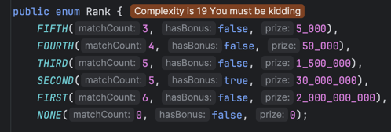
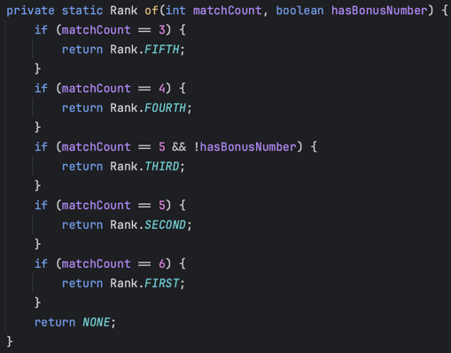

# 18일 차 회고

---

## 프리코스 18일 차 11/05

오늘은 로또 미션 기능 구현을 했다. 등수 계산 기능을 구현하는 데 시간이 오래 걸렸는데, 추가된 요구사항에 있는 enum을 적용하기에 적합하다는 생각이 들어서 enum으로 구현을 했다.

이런 식으로 만들었는데, 보너스 숫자 때문에 등수 계산이 까다로웠다. (복잡도 플러그인이 장난치냐고 묻는 중...)

좋은 방법을 계속 생각하다가 진도가 나가질 않아서, 우선 간단하게 이렇게 구현했다.

matchCount랑 보너스 여부로 점수를 계산해서 분기 문 없이 등수를 계산할 수 있을 것 같아서(matchCount는 2점, 보너스는 1점 이런 식으로) 기능 구현이 끝나면 적용해볼 예정이다.

그리고 오늘 구현하면서 어려웠던 점이 있었는데, 도메인 로직과 서비스 로직의 구분이 힘들었다. 현재는 도메인에 있어야 할 로직이 서비스에 있는 것 같기도 한데, 어떤 기준으로
정하고 나눠야 하는지 감이 오질 않는다.

## 마치며

오늘 목표는 기능 구현은 다 끝내고 리팩토링을 어느 정도 할 예정이었는데 가족 행사로 공부를 얼마 못했다.

같이 사는 외할머니의 98번째 생신을 축하드리기 위해 친척들이 전부 우리 집에 모였다. 할머니가 거동도 잘 못 하시고, 기력도 없으셔서 행복한 시간이 오래 남지 않았다는 생각이 들었다. 항상 손자 잘되라고 응원해주시는데, 좋은
결과 전해드리고 싶다. 부디 건강하셨으면 좋겠다.

내일은 하나 남은 기능인 에러 핸들링과 리팩토링을 진행 할 예정이다.

### 리팩토링 할 내용

- record 적용하기
- BigDecimal 고려하기
- 로또 판매점 만들기
- 출력 메세지 템플릿 사용하기
- 로또 구매할 때 구매 수량 대신 구매 금액 사용하기
- 의존성 주입 사용하기
- 에러 메세지 관리하는 클래스 만들기
