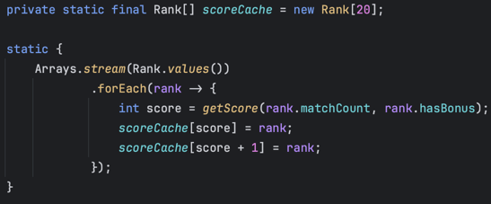
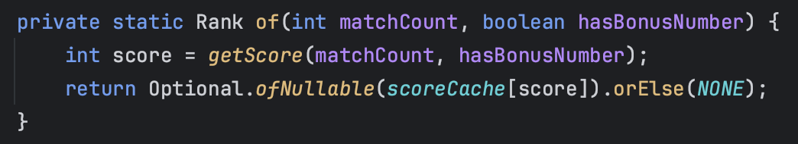

# 19일 차 회고

---

## 프리코스 19일 차 11/06

### 트랜잭션 스크립트 vs 도메인 모델 패턴

오늘은 기능 구현 끝내고, 리팩토링을 계속 했다. 오늘 가장 많은 시간을 투자한 내용은 도메인과 서비스 중 어느 곳에 로직을 얼마나 둬야 하는지 판단이 서질 않아서 계속 바꿔보면서 이것저것 시도를 했던 것 같다.

도메인이 간단한 로직만 가지고 서비스에서 처리하는 걸 트랜잭션 스크립트 패턴이라고 하고 도메인에서 대부분의 로직을 처리하는 걸 도메인 모델 패턴이라고 하는데, 도메인 모델을 따르는 게 객체 지향에 가깝다고 한다.

그런데, 도메인 모델로 개발을 하면서 느낀점이 있는데, 객체간 연관관계가 얽혀있어서 테스트 코드 작성이 쉽지 않았다. 내가 테스트 코드 작성에 대한 요령이 없어서 더 그렇게 느꼈던 것 같기도 하다. 계속 구조를 바꾼
결과 트랜잭션 스크립트 패턴에 가까워졌는데, 시간이 많이 있지는 않아서 일단 이렇게 구현하고 나중에 도메인 모델로 변경을 하든지 해야겠다.

### BigDecimal 적용

수익률을 계산하는 부분에 BigDecimal을 적용했다. 미션의 요구사항이 수익률을 계산해서 소수점 1자리 까지 표시하는 것이고, 수익률은 미세한 오차가 있어도 수용 가능한 부분이라고 생각이 들어서 double로도
충분하다고 생각이 들었는데, BigDecimal을 한 번도 사용을 해보지 않아서 학습 차원에서 적용을 해봤다.

BigDecimal 사용할 때 주의할 점이 있었는데, BigDecimal 생성자에 1.12 이렇게 숫자를 넣게되면 1.12가 double로 먼저 바뀌고 그 값이 BigDecimal에 적용이 된다. 따라서
double에서 생긴 오차가 BigDecimal에 저장될 수 있으니 "1.12" 이렇게 꼭 문자열을 사용해서 초기화 해주자.

### 로또 순위 계산

로또 순위를 어떻게 하면 쉽게 구할까 생각하다가 어제 생각난 아이디어가 있어서 그 내용을 적용했다.

순위를 구하기 까다로웠던 이유는 2등과 3등의 맞춘 개수가 동일하고 보너스 여부에 따라서 등수가 달라졌기 때문이었다. 그래서 맞춘 개수랑 보너스 여부를 둘 다 확인해야 하는데 대신 점수를 계산하는 방식을 적용했다.

점수 계산 방식은 맞춘 개수는 2점, 보너스 번호는 1점으로 계산했다. 이렇게 한 이유는 보너스 번호가 있고 없고 두 가지 경우의 수가 있기 때문인데, 만약 보너스 번호가 2개라면 보너스 번호로 만들 수 있는
점수가 [0, 1, 2] 이기 때문에 맞춘 개수는 3점으로 계산하면 된다. 그러면 점수라는 수직선 상에 등수를 겹치지 않고 일렬로 놓을 수 있다.

점수 계산을 마친 후 각 등수가 가지고 있는 점수는 다음과 같다.

```text
5등: 6점
4등: 8점
3등: 10점
2등: 11점
1등: 12점
```

등수별 점수가 중복되지 않기 때문에, 맞춘 개수와 보너스 여부를 전달 받아서 점수를 계산하고 등수를 순회하면서 해당 등수의 점수보다 높으면 그 등수를 반환하면 된다.

여기에 더해서 1주차 미션을 진행할 때 enum에 캐시를 적용한 적이 있었는데, 그 내용을 여기에도 적용할 수 있을 것 같아서 이렇게 적용을 해봤다.



배열에 점수를 초기화 한 덕분에 등수를 구할 땐 다음처럼 간단하게 구할 수 있다.



배열 대신 맵에 저장하는 방법이 더 좋을 것 같아서 리팩토링을 해야겠다.

### 마치며

내일은 남은 항목을 리팩토링 하고, 오늘 만든 에러 핸들링 기능도 클래스로 분리를 할 예정이다.

- [x] record 적용하기
- [x] BigDecimal 고려하기
- [x] 로또 판매점 만들기
- [x] 출력 메세지 템플릿 사용하기
- ~~로또 구매할 때 구매 수량 대신 구매 금액 사용하기~~
- 의존성 주입 사용하기
- 에러 메세지 관리하는 클래스 만들기
