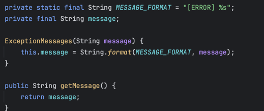

# 20일 차 회고

---

## 프리코스 20일 차 11/07

오늘은 어제 남은 리팩토링 항목을 진행하고, 전체적인 완성도를 점검했다.

### 메세지 관리 클래스

나는 1, 2주 차 미션을 진행할 때 상수를 사용하는 클래스 안에 private static final 로 상수를 정의했다.

그런데 코드 리뷰를 하면서 상수를 모아서 관리하는 분들이 많이 계신걸 알게 되었고, 그 중 enum 클래스를 만들어서 접두사를 붙여주신 분도 계셨다.

이번 미션에 오류가 발생하면 [error] ... 메세지를 출력하고 재시도한다는 요구사항이 있어서 나도 enum 클래스를 사용해서 메세지 관리를 하게 변경했다.



이렇게 만들면 상수에 일일이 접두사를 명시하지 않아도 되고 메세지 포맷이 변경되어도 쉽게 수정할 수 있다.

### 의존성 주입

스프링을 사용할 때 Config 클래스에 Bean을 등록해서 사용하는 것처럼 의존성 관리를 하는 클래스를 만들었다.

```java
public class Config {

    private Config() {
    }

    private static class LottoControllerHolder {
        private static final LottoController INSTANCE =
                new LottoController(new InputView(), new OutputView(), new LottoService(new LottoShop()));
    }

    public static LottoController getLottoController() {
        return LottoControllerHolder.INSTANCE;
    }
}

```

의존성도 관리하고 싱글톤으로 만들고 싶어서 이렇게 만들었는데, Config의 getLottoController()를 사용하면 싱글톤이 유지가 되겠지만 생성자를 사용해서 만들면 싱글톤이 깨지기 때문에 싱글톤은 다른
방법을 고민해봐야겠다. 지금 생각나는 방법은, 각 클래스를 전부 싱글톤으로 만들고 컨테이너에 등록한 다음 Config에서는 컨테이너에 등록된 빈을 가지고 의존성을 설정하는 방식으로 하면 될 것 같기도 하다.

### 적절한 책임

오늘 가장 많은 시간을 투자한 내용은 객체들이 적절한 책임을 가지고 있는지 확인하는 부분이었다. 전에 읽었던 오브젝트라는 책에 정보 전문가에게 책임을 지게 하라는 말이 있었는데, 그걸 기준으로 리팩토링을 진행했다.

여러 클래스 중 특히 LottoTickets에 문제가 있다고 생각됐는데, 기존 LottoTickets는 이렇게 생겼다.

```java
public record LottoTickets(List<Lotto> lottos, PurchaseAmount purchaseAmount) {

    public EnumMap<Rank, Integer> getRankResult(WinningTicket winningTicket) {
        EnumMap<Rank, Integer> rankResult = initRankResult();

        lottos.stream()
                .map(winningTicket::match)
                .map(Rank::of)
                .filter(rank -> rank != Rank.NONE)
                .forEach(rank -> rankResult.put(rank, rankResult.get(rank) + 1));

        return rankResult;
    }

    private EnumMap<Rank, Integer> initRankResult() {
        EnumMap<Rank, Integer> rankResult = new EnumMap<>(Rank.class);
        for (Rank rank : Rank.values()) {
            rankResult.put(rank, 0);
        }
        rankResult.remove(Rank.NONE);
        return rankResult;
    }

    public BigDecimal getRateOfReturn(long totalPrize) {
        return new BigDecimal(totalPrize)
                .multiply(new BigDecimal("100"))
                .divide(new BigDecimal(purchaseAmount.amount()), 1, RoundingMode.HALF_UP);
    }
}

```

enumMap을 직접 생성하고, Rank가 NONE이 아니면 enumMap에 put을 해서 개수를 세는 일을 하고 있으며, 수익률을 직접 계산하고 있다.

LottoTickets의 책임을 적절히 분리한 결과는 다음과 같다.

```java
public record LottoTickets(List<Lotto> lottos, PurchaseAmount purchaseAmount) {

    public RankResult getRankResult(WinningLotto winningLotto) {
        RankResult rankResult = new RankResult();

        lottos.stream()
                .map(winningLotto::match)
                .forEach(rankResult::add);

        return rankResult;
    }

    public BigDecimal getRateOfReturn(long totalPrize) {
        return purchaseAmount.getRateOfReturn(totalPrize);
    }
}

```

EnumMap 초기화와 데이터 넣는 작업은 RankResult가 하게 했고, 수익률은 데이터를 가진 PurchaseAmount가 직접 하도록 변경했다. 리팩토링 전과 비교해서 로직이 더 명확하게 보이는 것 같아서
만족스러웠다.

### 마치며

오늘 시작할 때만 해도 테스트는 정상 동작을 하는데 코드가 너무 지저분한 느낌이어서 이게 말로만 듣던 동작하는 쓰레기구나.. 했었는데, 클래스를 하나하나 뜯어보면서 계속 리팩토링했더니 어느 정도 봐줄만 해진 것 같다.

내일은 소감문 작성을 하고 시간이 남으면 IOC 컨테이너를 만들어 볼 예정이다. 