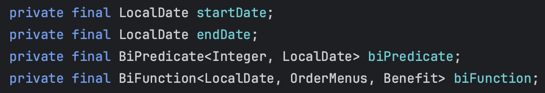
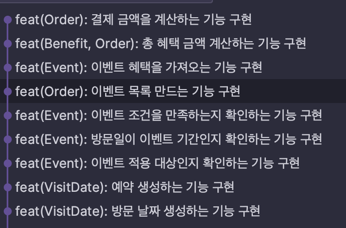

# 23일 차 회고

---

## 프리코스 23일 차 11/10

오늘은 크리스마스 프로모션 미션 구현을 이어서 진행했다. 어제 주문 관련 기능은 거의 다 만들어서 이벤트 기능을 만들었는데, 메뉴와 비슷하게 이벤트가 5개나 되니까 enum으로 Event class를 만들고 구현을
시작했다.

그런데, 구현하면서 진도가 진짜 안 나가고 어떻게 만들어야 할지 생각이 나질 않았다. 테스트를 작성할 때도 시간이 오래 걸리고 깔끔하게 나오지 않아서 뭔가 잘못 구현했다는 생각이 들었다.

Event enum 클래스도 기능이 추가되면서 아래 사진처럼 필드가 늘어났다.

할인 적용 여부를 판단하는 BiPredicate와 할인 혜택을 반환하는 BiFunction이 추가되면서 각 이벤트 생성자 부분도 많이 늘어났고 Event 클래스는 점점 더 복잡해졌다. 중간부터 다시 새로 하자는
마음이 크게 들었지만, 일단 주요 기능은 마무리해보자는 생각으로 기능 구현은 어거지로 끝마쳤다.

코드가 너무 뒤죽박죽이라 여기서 리팩토링하기보다는 다시 만드는 게 더 좋을 것 같아서, 브랜치를 만들어서 이 코드는 저장해놓고 main 브랜치는 origin에서 다시 받아와서 새로 시작을 하기로 했다.

이번에는 Event 기능을 구현할 때 enum 말고 일반 클래스로 구현하고, 이벤트도 한 번에 다 만들지 않고 하나씩 추가하는 방식으로 진행할 예정이다.

## 마치며

이번 미션에는 설계를 깊게 생각하지 않고 보이는 기능 목록만 작성하고 바로 시작을 했는데, 그래서 중간에 진도가 안 나가고 생각이 점점 꼬인 것 같다. 그래도 이런 시행착오 끝에 내게 맞는 구현 방식을 알아갈 수
있을 거라고 생각한다. 좋게 생각하고 화이팅하자!
