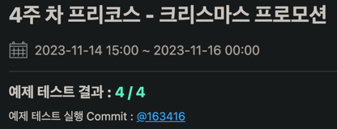

# 26, 27일 차 회고

---

## 프리코스 26, 27일 차 11/13, 11/14

13, 14일 이틀동안 리팩토링을 계속했다. 코드 작성한 시간은 그렇게 많지 않고, 어떻게 개선을 해야 할지 고민하는 데 시간을 보낸 것 같다.

그런데도 좋은 생각이 떠오르지 않아서 구조적으로 크게 개선한 내용은 없고 코드 스멜을 없애는 리팩토링만 많이 했다. 포스팅하기엔 너무 자잘한 내용이라 내용을 딱히 적을 필요는 없을 것 같다.

14일 3시부터 미션 제출 가능 시간이라 저번 주에 사용했던 오류 핸들링 기능을 급하게 추가하고 미션을 제출해봤다.

다행히 테스트는 전부 통과를 한 것 같다. 이제 남은 시간에는 빼먹은 테스트 코드를 마저 작성하고, 엣지 케이스를 테스트하면서 버그를 찾아야겠다.

## 마치며

미션 제출을 하고 나니 이제 진짜 끝이구나 하는 생각이 들었다. 너무 재밌어서 더 하고 싶은데, 자소서가 자신이 없어서 좋은 결과가 있을 가능성은 작을 것 같긴 하다. 소감문이라도 열심히 작성해야지 ㅠㅠ 내 진심이
전해졌으면 좋겠다.
